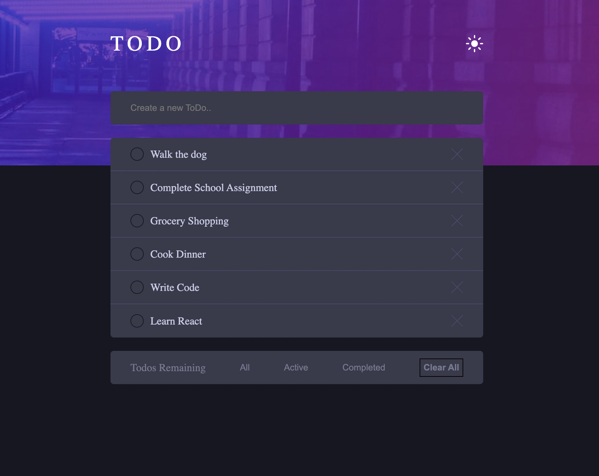

#  TODO App

This is a solution to the [Todo App challenge on Frontend Mentor](https://www.frontendmentor.io/challenges/todo-app-Su1_KokOW/hub).

## Table of contents

- [Overview](#overview)
  - [The challenge](#the-challenge)
  - [Screenshot](#screenshot)
  - [Links](#links)
- [My process](#my-process)
  - [Built with](#built-with)
  - [What I learned](#what-i-learned)
- [Author](#author)

## Overview

### The challenge

Users should be able to:

- View the optimal layout for the game depending on their device's screen size
- See hover states for all interactive elements on the page
- Add new Todo
- Mark Todo items as complete
- Remove Todo items
- See Todo list based on All, Active and Completed Todos

### Screenshot

### Links

- Live Site URL: [Github Pages](https://danielheppenstiel.github.io/Todo-App/)

## My process

### Built with

- Semantic HTML5 markup
- JavaScript
- CSS custom properties
- Flexbox
- CSS Grid
- Mobile first workflow

### What I learned

This challenge allowed me to sharpen my DOM manipulation skills. I used logic and control flow statements to achive my desired functionality for this Todo App challenge.

## Author

- Website - [Daniel Heppenstiel](https://danielheppenstiel.dev/)
- Frontend Mentor - [@Danielheppenstiel](https://www.frontendmentor.io/profile/Danielheppenstiel)
- Twitter - [@DevWithDan](https://twitter.com/DevWithDan)
